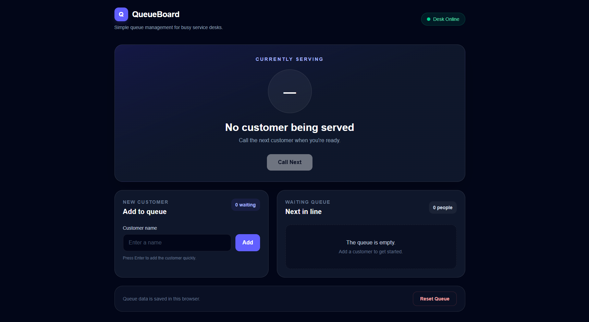
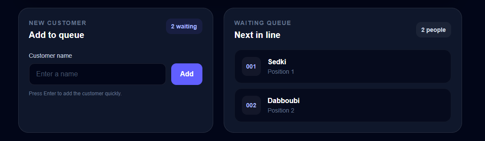

# QueueBoard

QueueBoard is a lightweight web application for managing a service desk queue.

Users can add customers to a waiting queue, call the next customer, view the currently served customer, and reset the queue. Queue data is persisted locally in the browser.

## Why I Built It

This project was built as a practical Next.js and TypeScript project focused on interactive client-side state, browser persistence, and building a simple application around a real-world workflow.

## Features

* Add customers to a waiting queue
* Automatically assign queue numbers
* Call the next customer in line
* Display the currently served customer
* Show the number and position of waiting customers
* Reset the queue
* Persist queue data using browser `localStorage`
* Restore saved queue data when the application is reopened
* Handle empty-queue states gracefully

## Technologies

* Next.js 16
* React 19
* TypeScript
* Tailwind CSS 4
* Browser `localStorage`

## How It Works

QueueBoard keeps its application state on the client side.

The queue state contains:

* Waiting customers
* Current customer being served
* The next queue number

The application uses React's `useSyncExternalStore` to subscribe to queue-state changes and update the interface whenever the state changes.

Queue data is serialized and stored in `localStorage`, allowing the application to restore the previous queue when the browser is reopened.

## Getting Started

### Requirements

* Node.js
* npm

### Installation

Clone the repository:

```bash
git clone https://github.com/sedki1223/queueboard.git
cd queueboard
```

Install dependencies:

```bash
npm install
```

### Run in Development

```bash
npm run dev
```

Open http://localhost:3000 in your browser.

### Production Build

Create a production build:

```bash
npm run build
```

Start the production server:

```bash
npm start
```

### Lint

Run ESLint:

```bash
npm run lint
```

## Project Structure

```text
queueboard/
├── app/
│   ├── globals.css
│   ├── layout.tsx
│   ├── page.tsx
│   └── queue-store.ts
├── public/
├── .gitignore
├── next.config.ts
├── package.json
├── package-lock.json
├── postcss.config.mjs
├── tsconfig.json
└── README.md
```
## Screenshots

### Dashboard


### Queue Management


### Call Next


## Project Status

Completed and functional.

## Author

Sedki Dabboubi
